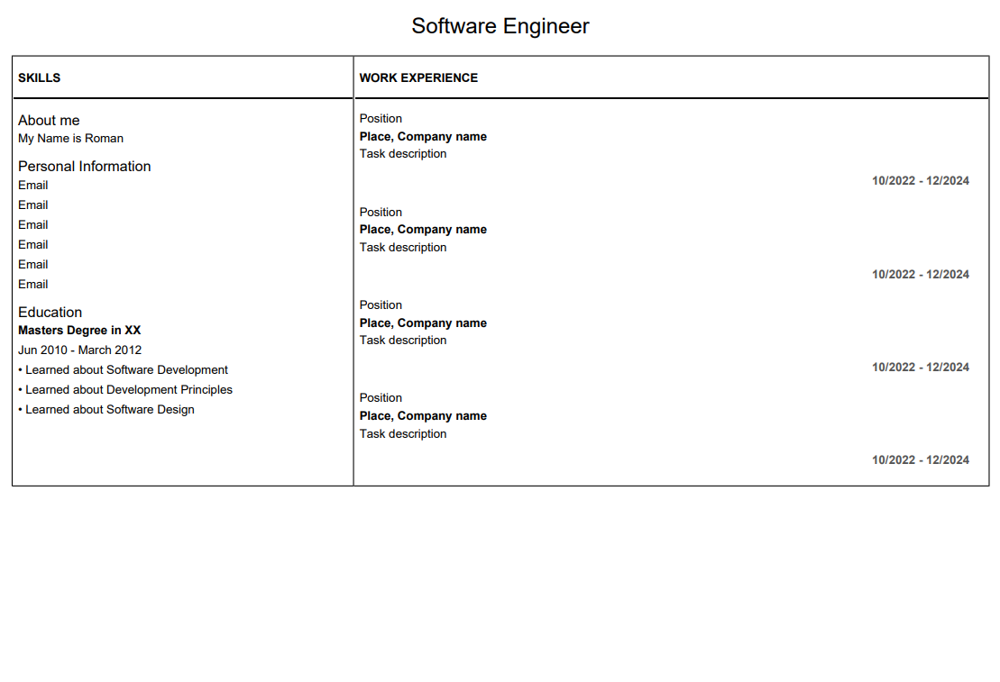

# 🧾 DomPDF to HTML2PDF Fix for CV Template (Stack Overflow #79600503)

This repository is a working example and fix for a [Stack Overflow question (#79600503)](https://stackoverflow.com/q/79600503), where the user needed to generate a CV-style PDF that preserved layout and styling—but DomPDF failed due to unsupported CSS (e.g. flexbox and Bootstrap classes).

## ❓ Problem

PDF output looked broken because:
- ❌ Flexbox & Bootstrap classes like `d-flex`, `justify-content-between`, etc., are **not supported** by DomPDF.
- ❌ Large, external CSS files were not being rendered properly.
- ❌ Layouts relying on modern CSS features were distorted or misaligned in the PDF.

## ✅ Solution

This project provides:
- ✔️ A simplified, PDF-compatible HTML structure
- ✔️ Inline CSS with table-based layout
- ✔️ A working PDF generator using `spipu/html2pdf`
- ✔️ A clear, lightweight example that preserves most of the original design intent

## 🛠 Requirements

- PHP 8.x or 7.4+
- Composer

## 🚀 Quick Start

1. Clone the repo:
   ```bash
   git clone https://github.com/marktaborosi/stackoverflow-79600503.git
   cd stackoverflow-79600503
   ```

2. Install dependencies:
   ```bash
   composer install
   ```

3. Start a local PHP server:
   ```bash
   php -S localhost:3000 -t src/
   ```

4. Open in browser:
   ```
   http://localhost:3000/
   ```

This will generate the desired pdf file using `spipu/html2pdf`.

### Generated PDF preview


## 📦 Built With

- [Spipu/Html2Pdf](https://github.com/spipu/html2pdf) – for reliable PDF rendering from HTML
- PHP's built-in web server – for quick testing
- Minimal inline CSS – for full DomPDF/HTML2PDF compatibility

## 📬 Author

**Mark Taborosi**  
📧 mark.taborosi@gmail.com

## 📄 License

This project is open-sourced under the [MIT License](LICENSE).

---